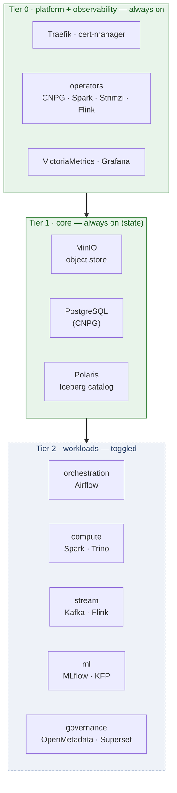
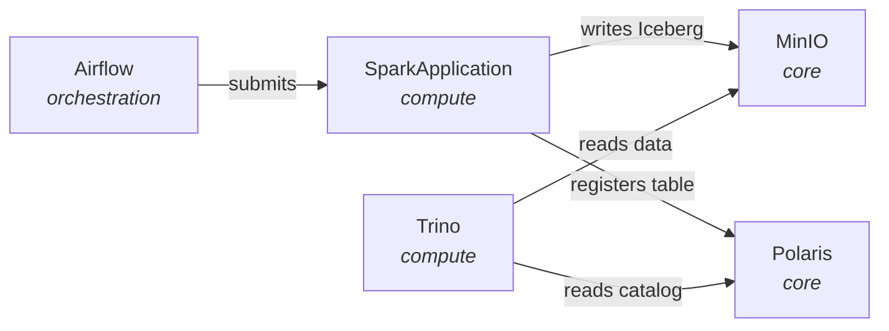

# homelab-infra

A single-node Kubernetes data platform, managed as declarative Helmfile stacks that toggle by lifecycle tier. The whole cluster — object store, catalog, orchestration, compute, streaming, ML — fits inside a **27 GiB homelab node** by keeping a small base always on and switching heavier workloads on and off with one command.

Built as a portfolio piece for ML platform engineering: the interesting part is not the tool list but the decisions that make a production-shaped stack fit on one machine and stay reproducible.

## Highlights

- **Lifecycle tiers, not one big deploy.** A resident base (ingress, operators, object store, catalog, PostgreSQL) stays up; workload engines toggle. `mise run up --stack compute`, `mise run down --stack compute` — memory returns to the node when a workload is off.
- **The repo is the source of truth.** Every chart version is pinned, and `mise run diff` shows any divergence between the repo and the cluster. No hidden `kubectl apply` history.
- **Operators separated from their workloads.** CNPG, Spark, Strimzi and Flink operators live once in the always-on base; the custom resources they manage (Kafka clusters, SparkApplications) come and go with the toggled stacks. Toggling an operator would orphan live CRs — so it never toggles.
- **Secrets never touch git.** Passwords live in a gitignored `.env`; `mise run secrets:sync` turns them into Kubernetes Secrets the charts adopt by name. Nothing in the repo, and nothing in a rendered manifest, is a credential.
- **Resource-budgeted by design.** Every release declares requests/limits and every namespace has a ResourceQuota, because on 27 GiB a runaway Spark executor cannot be allowed to starve the control plane.

## Architecture at a glance

Stacks are grouped by lifecycle. Operators live once in the base; their custom resources toggle with the workload stacks.



A batch pipeline exercises the whole stack: Airflow orchestrates a Spark job that writes an Iceberg table to MinIO, registers it in Polaris, and Trino queries it back.



Tiers, namespaces, profiles, the memory budget and where-to-put-something rules: [docs/architecture/stacks.md](docs/architecture/stacks.md).

## Stacks

| Stack                     | Tier | Contents                                                   | Status  |
| ------------------------- | ---- | ---------------------------------------------------------- | ------- |
| `platform`                | 0    | Traefik, cert-manager, namespaces + quotas, every operator | ✅      |
| `observability`           | 0    | VictoriaMetrics k8s-stack, Grafana, VictoriaLogs           | planned |
| `core`                    | 1    | MinIO, PostgreSQL (CNPG), Polaris                          | ✅      |
| `workloads/orchestration` | 2    | Airflow                                                    | ✅      |
| `workloads/compute`       | 2    | Spark, Trino                                               | planned |
| `workloads/stream`        | 2    | Kafka, Flink, kafka-ui                                     | planned |
| `workloads/ml`            | 2    | MLflow, Kubeflow Pipelines                                 | planned |
| `workloads/governance`    | 2    | OpenMetadata, Superset                                     | planned |

`mise run status` lists what is actually deployed; a stack gets its folder when it lands.

## Run it on your own cluster

Bring your own Kubernetes (k3s, k3d, kind, bare metal). Nothing cluster-specific is committed — you need `kubectl` access via a kubeconfig. k3s with `--disable traefik` is recommended, since Traefik comes from the platform stack.

```bash
mise trust
mise install                 # helm, helmfile, kubectl, jq
mise run bootstrap           # helm-diff plugin
export KUBECONFIG=/path/to/your/kubeconfig

cp environments/example.yaml environments/homelab.yaml   # pick any env name
cp .env.example .env                                     # fill in the passwords
$EDITOR environments/homelab.yaml .env
```

`environments/<env>.yaml` holds everything cluster-specific — storage class, ingress host suffix, MinIO bucket names, endpoints, and per-stack sizing. See [environments/example.yaml](environments/example.yaml).

Then bring up the stacks in tier order:

```bash
mise run up --stack platform   # tier 0 — namespaces, quotas, Traefik, operators
mise run up --stack core       # tier 1 — MinIO, PostgreSQL, Polaris
mise run up --stack orchestration   # tier 2 — Airflow (toggle)
```

Tear down a workload and get the memory back; add `--purge` to delete the namespace and its PVCs:

```bash
mise run down --stack orchestration
mise run down --stack all          # every tier-2 stack, reverse order (base stays up)
```

Inspect anything: `mise run diff` (what an apply would change), `mise run status` (releases, pods, quota, node memory), `mise run secrets:show <name>`.

## Layout

```
homelab-infra/
├── mise.toml                 # tool versions + task entrypoints
├── helmfile.yaml             # root: bundles stacks/*
├── environments/example.yaml # everything cluster-specific
├── stacks/
│   ├── platform/             # always on — ingress, quotas, every operator
│   ├── observability/        # always on
│   ├── core/                 # always on — MinIO, PostgreSQL, Polaris
│   └── workloads/{orchestration,compute,stream,ml,governance}/   # toggled
└── docs/architecture/stacks.md
```

Each stack folder holds `helmfile.yaml`, `values/` and `manifests/`, so it is self-contained.

## Related

Workloads — Airflow DAGs, Spark applications, dbt models — live in a separate repo, **data-platform**. This repo is the runtime they run on: it deploys the cluster, data-platform deploys what runs inside it. The boundary is deliberate; a service belongs here, a spec/library/CLI belongs there.
